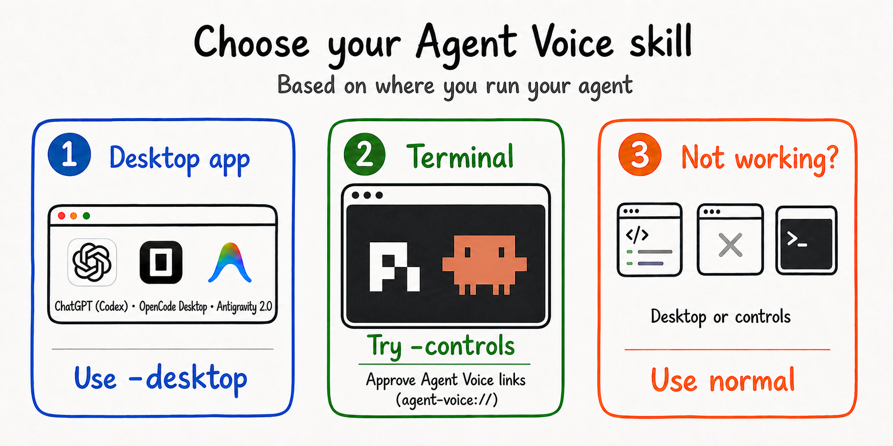
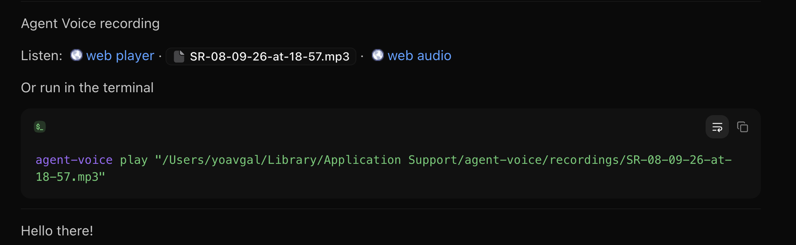
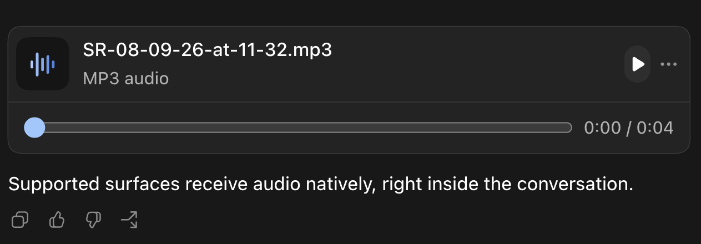
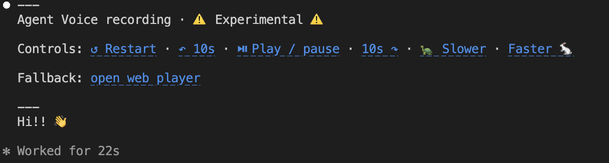

<p align="center">
  <picture>
    <source media="(prefers-color-scheme: dark)" srcset="assets/brand/agent-voice-logo-voiceprint-dark.svg">
    <source media="(prefers-color-scheme: light)" srcset="assets/brand/agent-voice-logo-voiceprint.svg">
    
  </picture>
  <br/>
  
</p>

---

Agent Voice gives AI agents the ability to create local speech recordings.

AI agents produce useful work, but they still communicate mostly through text.
Every response competes for a developer's visual attention, so valuable work is
often skimmed or missed.

My initial use case was listening alongside the text: text-to-speech for coding
agents such as Codex and Claude Code.

The larger idea is simple: audio should be a first-class medium for agents.

Agent Voice runs locally, uses
[Kokoro-82M](https://huggingface.co/hexgrad/Kokoro-82M), and requires no API
key. English is the best-supported language. The bundled 54-voice catalog also
covers Japanese, Mandarin Chinese, Spanish, French, Hindi, Italian, and
Brazilian Portuguese, though quality varies.

[Listen to the voice catalog](https://rewind.ai/voices/).

## Install and setup

Install the CLI with `uv`:

```sh
uv tool install agent-voice
```

Or with `pipx`:

```sh
pipx install agent-voice
```

Then download the speech model:

```sh
agent-voice setup
```

For setup with terminal playback controls, see
[Terminal playback controls](#terminal-playback-controls).

Test the CLI directly:

```sh
agent-voice speak "Hello from Agent Voice." -p
```

### Choose a skill

> [!NOTE]
> **The skills are starting points. Copy them to customize delivery wording,
> recording defaults, playback behavior, and when audio should be offered.**

Agent Voice provides two skill types:

- **`create-speech-recording`** turns supplied text into audio. Use it to create
  a recording or read something aloud.
- **`spoken-response`** creates the spoken semantic twin of an assistant
  response. It can speak the current response, the previous response, or later
  responses in the thread.

<p align="center">
  
</p>

#### Choose the variant based on where you run your agent

| Where you use your agent | Recommended variant | What you get |
| --- | --- | --- |
| ChatGPT (Codex), OpenCode Desktop, and Antigravity 2.0 | Use the `-desktop` skills | Embedded native or HTML audio player |
| A terminal | Try `-controls` skills first | Clickable `agent-voice://` playback controls with a web-player fallback |
| Any other setup, or when desktop delivery or terminal controls do not work | Use the normal skills | Portable Markdown links to the web player, media app, and web audio |

> [!NOTE]
> Other apps may also support `-desktop` or `-controls`. If your app is not
> listed, try the matching variant. Use the normal skills if neither works.

> [!TIP]
> Terminal controls should work in many terminals. Depending on your terminal
> and operating system, you may be asked to approve opening `agent-voice://`
> links. If the links are not clickable or do not open, use the normal skills.

#### Normal skills (most portable)

```sh
npx skills add yoav0gal/agent-voice -g --skill create-speech-recording
npx skills add yoav0gal/agent-voice -g --skill spoken-response
```

<p align="center">
  
</p>

#### Desktop skills (best experience for desktop app users)

```sh
npx skills add yoav0gal/agent-voice -g --skill create-speech-recording-desktop
npx skills add yoav0gal/agent-voice -g --skill spoken-response-desktop
```

<p align="center">
  
</p>

#### Controls skills (best experience in supported terminals)

> [!WARNING]
> Experimental feature.

```sh
agent-voice controls install
npx skills add yoav0gal/agent-voice -g --skill create-speech-recording-controls
npx skills add yoav0gal/agent-voice -g --skill spoken-response-controls
```

<p align="center">
  
</p>

Remove the handler with `agent-voice controls uninstall`.

## CLI

The CLI provides small primitives that agents can combine. Run
`agent-voice COMMAND --help` for the full options of any command.

| Command | What it does |
| --- | --- |
| `setup` | Download and verify speech model assets. |
| `update` | Upgrade Agent Voice through its `uv` or `pipx` installer. |
| `speak` | Turn text or stdin into a recording. |
| `play` | Play an existing local recording. |
| `voices` | List supported language tags and voices. |
| `models` | List speech models and variants. |
| `config` | View or change persistent defaults. |
| `doctor` | Check that Agent Voice is ready. |
| `service start\|stop` | Manage the background speech service. |
| `viewer start\|stop` | Manage the local recording viewer. |
| `controls install\|uninstall` | Install or remove the experimental `agent-voice://` protocol handler. |
| `serve` | Start the localhost speech API. |

### Speak

```sh
# Positional text
agent-voice speak "The build is finished."

# Agent output through stdin
printf '%s' "$TEXT" | agent-voice speak --label build-summary

# Spoken response text and written response Markdown in one command
agent-voice speak "$RESPONSE_AS_TEXT" \
  --markdown "$RESPONSE_AS_MARKDOWN" --label response

# Use separate files for a long spoken response and its written Markdown
agent-voice speak --response-file "$RESPONSE_AS_MARKDOWN_FILE" \
  < "$RESPONSE_AS_TEXT_FILE"

# Choose the output and delivery
agent-voice speak "Here is your summary." \
  --voice bf_emma --speed 1.2 --format mp3 -p
```

| Option | Purpose |
| --- | --- |
| `-o, --output PATH` | Write to an exact path. |
| `--label TEXT` | Set the managed filename prefix. |
| `--markdown TEXT` | Show an inline Markdown response in the viewer. |
| `--response-file PATH` | Show a Markdown response in the browser viewer. |
| `--output-dir DIR` | Choose the managed output directory. |
| `-f, --format FORMAT` | Use `wav`, `mp3`, `opus`, or `m4a`. |
| `-v, --voice NAME` | Select a voice. |
| `--lang TAG` | Set the language tag (default: `en-us`). |
| `--speed NUMBER` | Set pitch-preserving playback speed. |
| `-p, --play` | Start local playback after creation, without waiting for it to finish. |
| `--play-after SECONDS` | Schedule local playback after creation, without waiting. |
| `--controls` | Include experimental `agent-voice://` playback control links. |
| `--no-service` | Run the same Agent Voice model inside this command, then unload it. |
| `--model-id ID`, `--variant NAME` | Select a model and build. |

`speak` prints one JSON receipt with the absolute recording path, file URI,
audio metadata, playback state (`started` or `scheduled`), and available viewer
links. This makes the command reliable for both people and agents.

### Configure defaults

```sh
# Show current defaults
agent-voice config

# Set your preferred voice, speed, format, service timeout, and output directory
agent-voice config --voice bf_emma --speed 1.15 --format mp3 \
  --service-timeout 10 --output-dir ./recordings

# Restore built-in defaults
agent-voice config --reset
```

Voice, speed, format, and output directory can be overridden per recording with
`speak`.

### Manage the Agent Voice service

By default, `speak` starts the Agent Voice background service when needed. Once
the model weights are loaded, the service keeps them warm between requests to
avoid another cold startup. It stops after 10 idle minutes by default, and each
completed speech request restarts that timer. Automatic startup reuses a running
service without changing its timeout; `service start` uses the saved timeout or
an explicit `--idle-timeout` value.

```sh
agent-voice service start                    # stops after 10 idle minutes
agent-voice service start --idle-timeout 30  # set this process to 30 minutes
agent-voice service stop
```

Use `agent-voice serve` for a foreground service while debugging.

### Discover and diagnose

```sh
agent-voice voices
agent-voice models
agent-voice doctor
agent-voice doctor --json
```

`voices` groups each installed voice under its supported `--lang` tag. Select a
pair with `agent-voice speak --lang TAG --voice VOICE "Text"`.

Use `--json` with `voices`, `models`, `config`, or `doctor` when another tool or
agent will consume the result.

### Play and view recordings

```sh
agent-voice play "/absolute/path/recording.mp3"
agent-voice play "/absolute/path/recording.mp3" --after 10
agent-voice viewer start
agent-voice viewer stop
```

The lightweight viewer starts automatically when needed and serves only local
recordings. It prefers `http://127.0.0.1:8779` and selects a free port if that
port is unavailable. Each managed recording keeps an editable `.txt` source
beside it. At startup and every six hours, the viewer removes owned audio older
than four days and 18 hours; files without Agent Voice source, transcript, and
language metadata are left alone. Opening a player or audio URL regenerates
missing audio from its source with the original language and current voice and
speed.

Playback commands return as soon as local playback starts, or immediately with
`scheduled` when a delay is requested; they never wait for the recording to end.

> [!NOTE]
> 🗒️ The viewer is a workaround for agent surfaces that do not support embedded
> audio. I expect native text-to-speech to become common across these platforms,
> which would be a better solution. For now, the viewer keeps playback and the
> written response together in a local page. 🗒️

### Local speech API

```sh
agent-voice serve

curl http://127.0.0.1:8765/v1/audio/speech \
  -H 'Content-Type: application/json' \
  -d '{"input":"The task is complete.","voice":"af_heart","response_format":"mp3"}' \
  --output speech.mp3
```

The API binds to localhost. `speak` uses it when available and falls back to
embedded inference.

### Platform limitations

Prebuilt dependencies support macOS arm64/x64, Linux x64, and Windows x64.
Linux arm64 requires a C build toolchain for miniaudio. On Windows arm64, use
x64 Python under emulation.
